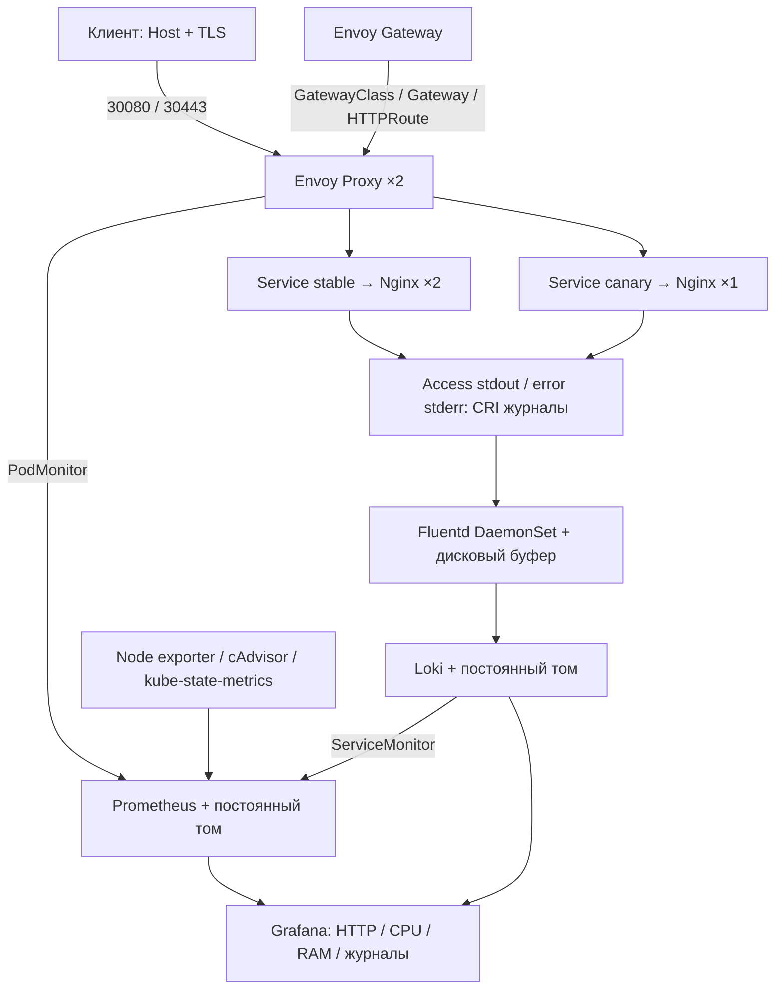

# MTC ENGINEER HACK — DevOps

Учебный проект по заданию DevOps. На Ubuntu 24.04 установлен Kubernetes через kubeadm. Приложение Nginx доступно через Envoy Gateway по HTTP и HTTPS. Prometheus собирает метрики, Fluentd передаёт access/error-логи в Loki, а Grafana показывает метрики и логи.

Для запуска нужна отдельная Ubuntu. Установщик меняет настройки этой машины и устанавливает пакеты. Если он обнаружит чужой кластер или kubeconfig, работа остановится. Повторный запуск рассчитан на тот же стенд и каталог проекта.

## Архитектура



Один узел Kubernetes, Calico обеспечивает маршрутизацию Pod и исполнение NetworkPolicy. Приложение принимает соединения только из namespace прокси Envoy; исходящие соединения приложения запрещены. Nginx работает без root, с read-only файловой системой и удалёнными Linux capabilities.

## Почему выбраны эти компоненты

- **kubeadm:** рекомендован в задании и позволяет развернуть обычный Kubernetes без привязки к облаку. Calico нужен для сети Pod и правил NetworkPolicy.
- **Nginx:** достаточно для ответа Hello World и формирования access/error-логов. Собственное приложение для этого задания не требуется.
- **Envoy Gateway:** поддерживает Gateway API, маршруты по имени и пути, TLS и распределение запросов между версиями приложения.
- **kube-prometheus-stack:** устанавливает Prometheus, Operator, exporters и Grafana одним Helm release. Сбор метрик описан в PodMonitor и ServiceMonitor.
- **Fluentd и Loki:** Fluentd входит в допустимый набор задания, Loki хранит логи и позволяет искать запросы. Буфер Fluentd на диске нужен для повторной отправки при недоступности Loki.
- **Bash, Python, Make и Helm:** выполняют установку и проверки. Версии основных зависимостей указаны явно.

## Быстрый запуск

Нужна **новая Ubuntu 24.04 amd64 или arm64**, доступ sudo, минимум 2 CPU / 6 GiB RAM / 10 GB свободного диска; рекомендуется 4 CPU / 8 GiB / диск 24 GB или больше. Swap должен быть выключен. Интернет требуется для пакетов, Helm charts, образов и Ruby gem. Проверенный стенд: Ubuntu 24.04.5 arm64, 4 CPU, 8 GiB RAM.

Команды развёртывания выполняются внутри этой Ubuntu. Для получения исходников нужен Git; если он отсутствует: `sudo apt-get update && sudo apt-get install -y git`.

```bash
git clone --branch main https://github.com/SteffanBreak/mtc-engineer-hack-devops.git
cd mtc-engineer-hack-devops
sudo bash scripts/bootstrap.sh --dedicated-host
make deploy
make verify
make demo
make resilience
```

`scripts/bootstrap.sh` устанавливает Make и фиксированные версии containerd/runc, kubeadm/kubelet/kubectl, Calico и Helm. Существующий кластер без маркера проекта приводит к остановке, а не к переинициализации. `make deploy` готовит тома и секреты, устанавливает Helm releases, собирает образ Fluentd на текущей архитектуре и импортирует его в containerd. `make verify` проверяет действующие компоненты и реальные данные. `make demo` дополнительно проверяет распределение между stable/canary на 200 запросах.

**Повторный запуск:** выполните `make idempotence`. Сначала сохраняется исходное состояние в `.local`, затем повторяются bootstrap/deploy. Скрипт сравнивает UID кластера и PVC, содержимое секретов и рабочие Pod, после чего запускает verify. TLS-ключ и пароль Grafana не создаются заново, данные остаются, неизменный Dockerfile не пересобирается. Номер ревизии Helm release при этом может увеличиться.

Результат автоматической проверки сохраняется в `.local/verification.json`. Каталог `.local` содержит приватные данные стенда, включён в `.gitignore` и не публикуется.

Для ознакомления с проектом: `scripts/` — установка и проверки; `charts/demo/` — приложение; `manifests/` — Gateway, хранилище и сбор журналов; `values/` — настройки Helm; `dashboards/` — Grafana; `evidence/` — результаты выполненных тестов. Дополнительный способ запуска на Apple Silicon описан в [локальном стенде](docs/local-lab.md).

## Проверить приложение вручную

Все команды ниже выполняются на Ubuntu стенда. `NODE_IP` — адрес этого узла:

```bash
NODE_IP=$(kubectl get nodes -o jsonpath='{.items[0].status.addresses[?(@.type=="InternalIP")].address}')
curl -H 'Host: demo.mtc.test' "http://$NODE_IP:30080/"
# Hello World! version=stable

curl -H 'Host: demo.mtc.test' "http://$NODE_IP:30080/canary"
# Hello World! version=canary

curl --cacert .local/tls/server.crt \
  --resolve "demo.mtc.test:30443:$NODE_IP" https://demo.mtc.test:30443/

curl -H 'Host: split.mtc.test' "http://$NODE_IP:30080/"
# stable: weight 90; canary: weight 10, статистическое распределение

kubectl -n mtc-lab get gateway,httproute
kubectl -n mtc-lab describe gateway mtc-gateway
kubectl -n mtc-lab describe httproute demo-routes
```

`demo.mtc.test` и `split.mtc.test` — учебные имена, покупка домена не требуется. `--resolve` передаёт правильные Host/SNI и адрес для HTTPS; простого HTTP-заголовка Host для TLS недостаточно. Самоподписанный сертификат доверяется только явным `--cacert`; срок 30 дней, SAN включает оба имени. Это демонстрационный TLS. Для эксплуатации нужен доверенный сертификат с автоматическим продлением.

## Мониторинг и журналы

```bash
kubectl -n mtc-observability port-forward service/mtc-monitoring-prometheus 9090:9090
# http://127.0.0.1:9090/targets и /graph
```

Prometheus получает метрики Envoy через PodMonitor (`metrics`, `/stats/prometheus`), Loki через ServiceMonitor, kubelet/cAdvisor, node-exporter, kube-state-metrics и стандартные доступные targets chart. Примеры PromQL:

```promql
up
sum(rate(envoy_http_downstream_rq_total{envoy_http_conn_manager_prefix=~"https?-.*"}[2m]))
sum by (envoy_response_code_class) (rate(envoy_http_downstream_rq_xx{envoy_http_conn_manager_prefix=~"https?-.*"}[2m]))
histogram_quantile(0.95, sum by (le) (rate(envoy_http_downstream_rq_time_bucket{envoy_http_conn_manager_prefix=~"https?-.*"}[2m])))
sum by (pod) (rate(container_cpu_usage_seconds_total{namespace="mtc-lab",container="nginx"}[2m]))
sum by (pod) (container_memory_working_set_bytes{namespace="mtc-lab",container="nginx"})
```

Фильтр listener исключает служебные запросы readiness и scrape из HTTP-статистики. Гистограмма Envoy измеряется в миллисекундах. Для графиков rate нужны минимум два scrape и запросы к приложению; при отсутствии трафика p95 может не иметь значения.

```bash
kubectl -n mtc-observability port-forward service/monitoring-grafana 3000:80
# http://127.0.0.1:3000 ; логин admin
# Пароль виден только владельцу стенда:
cat .local/grafana-password
```

Откройте дашборд **MTC DevOps — проверяемый стенд** (`uid=mtc-devops`). Он автоматически импортируется из `dashboards/mtc-demo.json`, содержит HTTP RPS, классы кодов ответа, p95, долю 5xx, CPU/RAM, готовность реплик, targets и журналы. Prometheus и Loki datasources также создаются автоматически.

Fluentd читает только CRI-файлы контейнера `nginx` namespace `mtc-lab` через read-only `/var/log`. JSON access-log находится в `log` записи; stderr содержит error-log. В Loki метки: `app`, `namespace`, `node`, `stream`. URI и request_id остаются в теле записи, чтобы избежать высокой кардинальности меток. LogQL:

```logql
{app="mtc-demo",stream="stdout"}
{app="mtc-demo",stream="stderr"}
{app="mtc-demo"} |= "mtc-check-"
```

`make verify` отправляет запрос с уникальным идентификатором и обращается к отсутствующему файлу `/error-test/<id>`. Затем он ищет access- и error-записи в Loki. Так проверяется доставка по цепочке Nginx → CRI → Fluentd → Loki. Буфер Fluentd хранится на диске и ограничен 256 MiB. При сбое Loki отправка повторяется, а при заполнении буфера чтение приостанавливается. Гарантии exactly-once нет.

## Фиксированные версии и зависимости

| Компонент | Версия / фиксация |
|---|---|
| Ubuntu | 24.04; проверено 24.04.5 arm64 |
| Kubernetes | v1.35.9, deb 1.35.9-1.1 |
| containerd / runc | 2.2.1 / 1.3.4, точные Ubuntu deb версии |
| Calico | v3.33.0 |
| Helm | v3.22.0, SHA256 архива проверяется |
| Envoy Gateway | Helm v1.9.2; CRD Gateway API поставляются chart |
| kube-prometheus-stack | chart 91.9.0, версии его зависимостей фиксированы chart |
| Nginx | 1.28.0-alpine + digest multiarch |
| Loki | 3.6.0 + digest multiarch |
| Fluentd | 1.19.3-debian-2.4 + digest multiarch |
| Loki Fluentd plugin | 1.3.0 + SHA256 gem |
| Docker / Buildx | 29.1.3 / 0.30.1, точные Ubuntu deb версии |

Источник фиксированных версий: `config/versions.env`, `images/fluentd/Dockerfile`. Docker используется только для сборки образа; Kubernetes работает через containerd. Docker daemon на выделенной машине не создаёт bridge и не меняет iptables. Готовый образ плагина Loki был заменён сборкой из официального многоархитектурного Fluentd: проверка воспроизводится без приватного registry участника.

Официальные источники: [матрица Envoy Gateway](https://gateway.envoyproxy.io/news/releases/matrix/), [метрики Envoy](https://gateway.envoyproxy.io/docs/tasks/observability/proxy-metric/), [требования Calico](https://docs.tigera.io/calico/latest/getting-started/kubernetes/requirements), [Fluentd → Loki](https://grafana.com/docs/loki/latest/send-data/fluentd/), [chart мониторинга](https://github.com/prometheus-community/helm-charts/tree/main/charts/kube-prometheus-stack).

## Проверки и соответствие кейсу

| Требование | Реализация | Проверка |
|---|---|---|
| Ubuntu 24.04 / Kubernetes | `scripts/bootstrap.sh` | версия ОС, kubectl version, Node Ready |
| HTTP приложение | `charts/demo` | HTTP 200 и точный Hello World |
| Gateway API | `manifests/gateway.yaml` | Accepted/Programmed, Route Accepted/ResolvedRefs текущей generation |
| Prometheus targets + запросы | `values/prometheus.yaml`, `manifests/monitoring.yaml` | healthy targets, CPU/RAM, рост счётчика после 20 запросов |
| Fluentd / хранение logs | Dockerfile + `manifests/fluentd.yaml`, `loki.yaml` | уникальный ID найден в stdout и stderr в Loki |
| Repro / повторный запуск | Makefile + pinned versions | повтор bootstrap/deploy/verify |
| TLS / Host / path | Gateway listeners / HTTPRoute | проверка сертификата, canary path, неизвестный Host 404 |
| Weighted backend | `demo-split` 90/10 | 200 запросов, обе версии, допустимый статистический интервал |
| Dashboard | `dashboards/mtc-demo.json` | HTTP-коды/p95/CPU/RAM/logs в Grafana |
| Reliability / security | probes, resources, 2 stable + 2 proxy, PDB, NetworkPolicy, PV Retain | readiness, rollout и проверки восстановления |
| CI | `.github/workflows/validate.yml` | Bash/Python syntax / Helm lint+render / YAML duplicate keys / source secret patterns |

GitHub Actions выполняет `make lint` и проверяет исходники. Работа установленного стенда проверяется отдельно командой `make verify` на Ubuntu с kubeadm. Результаты находятся в `evidence/`; там есть и отчёт о запуске на второй чистой Ubuntu.

Проверка также требует совпадения UID кластера, завершения текущей ревизии Deployment, двух healthy Envoy targets, корректного TLS для обоих имён и конечных числовых значений всех восьми PromQL-панелей (пустой результат, NaN и Infinity не принимаются). Все 20 запросов для проверки HTTP-счётчика должны вернуть точный ожидаемый ответ. Lint дополнительно разбирает синтаксис всех Python-скриптов и YAML вспомогательной локальной среды.

`make resilience` выполняет контролируемый rolling update stable под HTTP-запросами, затем перезапускает Loki и Prometheus и проверяет сохранение исходной записи журнала и исторического sample. Он работает только при совпадении UID стенда. В успешном прогоне приложение обработало 55 запросов без ошибок; результаты: `evidence/resilience-arm64.json`. Для плавного ухода Pod с трафика используется preStop с паузой и `nginx -s quit`.

## Что пришлось исправить при проверке

Готовый образ Fluentd с плагином Loki не подходил для выбранного ARM64-стенда. Поэтому образ собирается из официального multiarch Fluentd; версия плагина и контрольная сумма gem зафиксированы в Dockerfile. Это работает на проверенном одном узле. Для нескольких узлов образ нужно будет разместить в registry.

В первом тесте обновления Nginx один HTTP-запрос завершился ошибкой. В preStop добавлены пауза и `nginx -s quit`, чтобы дать запросам завершиться перед остановкой. После изменения повторный тест прошёл: 55 запросов, 0 ошибок. Сохранённый результат — `evidence/resilience-arm64.json`.

На чистой Ubuntu обнаружились два отличия от уже настроенного стенда: Make ещё не установлен, а Prometheus не сразу получает первые метрики. Поэтому первая команда запускает bootstrap напрямую через Bash, а verify ждёт появления targets и данных. Затем установка и повторный запуск проверены на второй новой VM; отчёты — `verification-fresh-arm64.json` и `idempotence-fresh-arm64.json` в `evidence/`.

## Ограничения и дальнейшее развитие

- **Кластер состоит из одного узла.** Реплики и PDB помогают при обновлении Pod. Если VM выключится, приложение будет недоступно. Для отказоустойчивости нужны несколько узлов и распределённое хранилище.
- **Local PV зависят от этого узла.** Политика Retain сохраняет данные при удалении PVC, но не заменяет резервные копии. Запрошенный размер PV не является квотой файловой системы; нужен контроль свободного диска. Prometheus: retention 24h / 1 GB; Loki: retention 24h с отложенным удалением.
- **TLS учебный.** Для эксплуатации — доверенный CA, cert-manager/ACME и автоматическое продление.
- **Часть системных метрик не собирается.** Endpoints scheduler/controller-manager/etcd и kube-proxy в kubeadm защищены или доступны только через loopback. Их сбор отключён в chart, настройки доступа не менялись. API server, kubelet, узел и приложение наблюдаются. Сам kube-proxy продолжает работать.
- **Fluentd имеет UID 0** для чтения root-owned файлов узла, но host logs read-only, нет Linux capabilities, hostNetwork, hostPID или Kubernetes token. Namespace наблюдаемости допускает node-exporter/hostPath; namespace приложения применяет Pod Security Restricted.
- **Сборка Fluentd локальна текущему узлу.** Для нескольких worker нужно собрать/опубликовать OCI multiarch образ и использовать digest; сейчас переносится воспроизводимый Dockerfile.
- Для телеком-нагрузки: проверить RPS/p95/p99 при потере backend, добавить SLO и error budget, алерты с уведомлениями, HPA по нагрузке, резервирование каналов и централизованное долговременное хранение журналов. Alertmanager установлен; внешняя доставка уведомлений требует согласованного канала и секрета, поэтому её статус не заявляется как настроенный.

## Диагностика

`make status` показывает узлы, workloads, Gateway/HTTPRoute и PVC. При сбое:

```bash
kubectl -n mtc-observability get pods
kubectl -n mtc-observability get events --field-selector type=Warning --sort-by=.lastTimestamp
kubectl -n envoy-gateway-system logs deployment/envoy-gateway --tail=50
kubectl -n mtc-observability logs daemonset/mtc-fluentd --tail=50
kubectl -n mtc-observability logs statefulset/mtc-loki --tail=50
df -h /
```

ImagePullBackOff: проверьте доступ к указанному официальному registry и повторите `make deploy` после восстановления сети. Не заменяйте теги на `latest`. Pending PVC: проверьте PV nodeAffinity и имя узла; тома этого стенда создаются скриптом автоматически. Ошибка `cluster identity` означает, что выбран другой kubeconfig; исправьте выбор, не удаляйте защиту. Никакой `kubeadm reset`, удаления каталогов или широких cleanup-команд для обычной эксплуатации не требуется.
