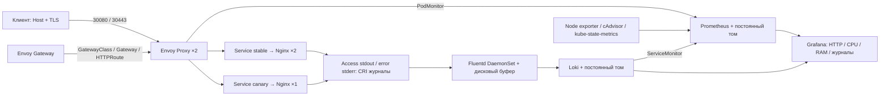

# MTC ENGINEER HACK — DevOps

Воспроизводимый стенд на **Ubuntu 24.04 + kubeadm**: Nginx обслуживает HTTP/HTTPS через настоящий **Envoy Gateway / Gateway API**; Prometheus собирает метрики, **Fluentd** отправляет access/error журналы в Loki, Grafana показывает данные в одном дашборде.

Решение рассчитано на отдельную учебную машину. Все изменения ОС выполняются внутри неё. Скрипты не сбрасывают Kubernetes, не удаляют данные и не перезаписывают чужой kubeconfig. Перед развёртыванием проверяется идентификатор созданного кластера.

## Архитектура



Один узел Kubernetes, Calico обеспечивает маршрутизацию Pod и исполнение NetworkPolicy. Приложение принимает соединения только из namespace прокси Envoy; исходящие соединения приложения запрещены. Nginx работает без root, с read-only файловой системой и удалёнными Linux capabilities.

## Почему выбраны эти компоненты

- **kubeadm + Ubuntu 24.04:** приоритетный способ из задания, без зависимости от облачного провайдера; Calico исполняет NetworkPolicy.
- **Nginx + Envoy Gateway:** публичное простое приложение с однозначным ответом и access/error logs; Gateway API даёт Host/path, TLS и weighted backends через стандартные ресурсы.
- **kube-prometheus-stack:** Helm chart связывает Prometheus, Operator, exporters и Grafana; PodMonitor/ServiceMonitor позволяют хранить настройку сбора рядом с приложением.
- **Fluentd + Loki:** соответствует обязательному выбору collector; файловый буфер повторяет доставку, Loki позволяет искать уникальные запросы, Grafana объединяет метрики и журналы.
- **Bash/Python/Make/Helm:** первоначальный запуск и проверки выполняются несколькими командами; зависимости фиксированы, отдельный управляющий сервер не требуется.

## Быстрый запуск

Нужна **новая Ubuntu 24.04 amd64 или arm64**, доступ sudo, минимум 2 CPU / 6 GiB RAM / 10 GB свободного диска; рекомендуется 4 CPU / 8 GiB / диск 24 GB или больше. Swap должен быть выключен. Интернет требуется для пакетов, Helm charts, образов и Ruby gem. Проверенный стенд: Ubuntu 24.04.5 arm64, 4 CPU, 8 GiB RAM.

```bash
# Клонируйте main этого публичного репозитория, затем перейдите в его каталог.
sudo bash scripts/bootstrap.sh --dedicated-host
make deploy
make verify
make demo
make resilience
```

`scripts/bootstrap.sh` устанавливает Make и фиксированные версии containerd/runc, kubeadm/kubelet/kubectl, Calico и Helm. Существующий кластер без маркера проекта приводит к остановке, а не к переинициализации. `make deploy` готовит тома и секреты, устанавливает Helm releases, собирает образ Fluentd на текущей архитектуре и импортирует его в containerd. `make verify` проверяет действующие компоненты и реальные данные. `make demo` дополнительно проверяет распределение между stable/canary на 200 запросах.

**Повторный запуск:** выполните `make idempotence`. Он снимает приватный baseline, повторяет bootstrap/deploy, сравнивает UID кластера и PVC, содержимое секретов и рабочие Pod, затем запускает verify. Скрипт bootstrap сохраняет кластер; TLS-ключ и пароль Grafana не генерируются повторно; PV/PVC и данные остаются; неизменный Dockerfile не пересобирается. Helm upgrade может увеличивать номер ревизии release, даже если Pod не пересоздаются.

Результат автоматической проверки сохраняется в `.local/verification.json`. Каталог `.local` содержит приватные данные стенда, включён в `.gitignore` и не публикуется.

## Проверить приложение вручную

Все команды ниже выполняются на Ubuntu стенда. `NODE_IP` — адрес этого узла:

```bash
NODE_IP=$(kubectl get nodes -o jsonpath='{.items[0].status.addresses[?(@.type=="InternalIP")].address}')
curl -H 'Host: demo.mtc.test' "http://$NODE_IP:30080/"
# Hello World! version=stable

curl -H 'Host: demo.mtc.test' "http://$NODE_IP:30080/canary"
# Hello World! version=canary

curl --cacert .local/tls/server.crt \
  --resolve "demo.mtc.test:30443:$NODE_IP" https://demo.mtc.test:30443/

curl -H 'Host: split.mtc.test' "http://$NODE_IP:30080/"
# stable: weight 90; canary: weight 10, статистическое распределение

kubectl -n mtc-lab get gateway,httproute
kubectl -n mtc-lab describe gateway mtc-gateway
kubectl -n mtc-lab describe httproute demo-routes
```

`demo.mtc.test` и `split.mtc.test` — учебные имена, покупка домена не требуется. `--resolve` передаёт правильные Host/SNI и адрес для HTTPS; простого HTTP-заголовка Host для TLS недостаточно. Самоподписанный сертификат доверяется только явным `--cacert`; срок 30 дней, SAN включает оба имени. Это демонстрационный TLS. Для эксплуатации нужен доверенный сертификат с автоматическим продлением.

## Мониторинг и журналы

```bash
kubectl -n mtc-observability port-forward service/mtc-monitoring-prometheus 9090:9090
# http://127.0.0.1:9090/targets и /graph
```

Prometheus получает метрики Envoy через PodMonitor (`metrics`, `/stats/prometheus`), Loki через ServiceMonitor, kubelet/cAdvisor, node-exporter, kube-state-metrics и стандартные доступные targets chart. Примеры PromQL:

```promql
up
sum(rate(envoy_http_downstream_rq_total{envoy_http_conn_manager_prefix=~"https?-.*"}[2m]))
sum by (envoy_response_code_class) (rate(envoy_http_downstream_rq_xx{envoy_http_conn_manager_prefix=~"https?-.*"}[2m]))
histogram_quantile(0.95, sum by (le) (rate(envoy_http_downstream_rq_time_bucket{envoy_http_conn_manager_prefix=~"https?-.*"}[2m])))
sum by (pod) (rate(container_cpu_usage_seconds_total{namespace="mtc-lab",container="nginx"}[2m]))
sum by (pod) (container_memory_working_set_bytes{namespace="mtc-lab",container="nginx"})
```

Фильтр listener исключает служебные запросы readiness и scrape из HTTP-статистики. Гистограмма Envoy измеряется в миллисекундах. Для графиков rate нужны минимум два scrape и запросы к приложению; при отсутствии трафика p95 может не иметь значения.

```bash
kubectl -n mtc-observability port-forward service/monitoring-grafana 3000:80
# http://127.0.0.1:3000 ; логин admin
# Пароль виден только владельцу стенда:
cat .local/grafana-password
```

Откройте дашборд **MTC DevOps — проверяемый стенд** (`uid=mtc-devops`). Он автоматически импортируется из `dashboards/mtc-demo.json`, содержит HTTP RPS, классы кодов ответа, p95, долю 5xx, CPU/RAM, готовность реплик, targets и журналы. Prometheus и Loki datasources также создаются автоматически.

Fluentd читает только CRI-файлы контейнера `nginx` namespace `mtc-lab` через read-only `/var/log`. JSON access-log находится в `log` записи; stderr содержит error-log. В Loki метки: `app`, `namespace`, `node`, `stream`. URI и request_id остаются в теле записи, чтобы избежать высокой кардинальности меток. LogQL:

```logql
{app="mtc-demo",stream="stdout"}
{app="mtc-demo",stream="stderr"}
{app="mtc-demo"} |= "mtc-check-"
```

`make verify` создаёт уникальный идентификатор, запрашивает успешный URI и отсутствующий файл `/error-test/<id>`, затем находит соответствующие access и error записи в Loki. Это проверяет всю цепочку **Nginx → CRI → Fluentd → Loki**, а не только наличие Pod. Буфер Fluentd сохраняется на диске, ограничен 256 MiB, повторяет доставку при сбое Loki. При заполнении буфера используется backpressure; бесконечное хранение и exactly-once не обещаются.

## Фиксированные версии и зависимости

| Компонент | Версия / фиксация |
|---|---|
| Ubuntu | 24.04; проверено 24.04.5 arm64 |
| Kubernetes | v1.35.9, deb 1.35.9-1.1 |
| containerd / runc | 2.2.1 / 1.3.4, точные Ubuntu deb версии |
| Calico | v3.33.0 |
| Helm | v3.22.0, SHA256 архива проверяется |
| Envoy Gateway | Helm v1.9.2; CRD Gateway API поставляются chart |
| kube-prometheus-stack | chart 91.9.0, версии его зависимостей фиксированы chart |
| Nginx | 1.28.0-alpine + digest multiarch |
| Loki | 3.6.0 + digest multiarch |
| Fluentd | 1.19.3-debian-2.4 + digest multiarch |
| Loki Fluentd plugin | 1.3.0 + SHA256 gem |
| Docker / Buildx | 29.1.3 / 0.30.1, точные Ubuntu deb версии |

Источник фиксированных версий: `config/versions.env`, `images/fluentd/Dockerfile`. Docker используется только для сборки образа; Kubernetes работает через containerd. Docker daemon на выделенной машине не создаёт bridge и не меняет iptables. Готовый образ плагина Loki был заменён сборкой из официального многоархитектурного Fluentd: проверка воспроизводится без приватного registry участника.

Официальные источники: [матрица Envoy Gateway](https://gateway.envoyproxy.io/news/releases/matrix/), [метрики Envoy](https://gateway.envoyproxy.io/docs/tasks/observability/proxy-metric/), [требования Calico](https://docs.tigera.io/calico/latest/getting-started/kubernetes/requirements), [Fluentd → Loki](https://grafana.com/docs/loki/latest/send-data/fluentd/), [chart мониторинга](https://github.com/prometheus-community/helm-charts/tree/main/charts/kube-prometheus-stack).

## Проверки и соответствие кейсу

| Требование | Реализация | Проверка |
|---|---|---|
| Ubuntu 24.04 / Kubernetes | `scripts/bootstrap.sh` | версия ОС, kubectl version, Node Ready |
| HTTP приложение | `charts/demo` | HTTP 200 и точный Hello World |
| Gateway API | `manifests/gateway.yaml` | Accepted/Programmed, Route Accepted/ResolvedRefs текущей generation |
| Prometheus targets + запросы | `values/prometheus.yaml`, `manifests/monitoring.yaml` | healthy targets, CPU/RAM, рост счётчика после 20 запросов |
| Fluentd / хранение logs | Dockerfile + `manifests/fluentd.yaml`, `loki.yaml` | уникальный ID найден в stdout и stderr в Loki |
| Repro / повторный запуск | Makefile + pinned versions | повтор bootstrap/deploy/verify |
| TLS / Host / path | Gateway listeners / HTTPRoute | проверка сертификата, canary path, неизвестный Host 404 |
| Weighted backend | `demo-split` 90/10 | 200 запросов, обе версии, допустимый статистический интервал |
| Dashboard | `dashboards/mtc-demo.json` | HTTP-коды/p95/CPU/RAM/logs в Grafana |
| Reliability / security | probes, resources, 2 stable + 2 proxy, PDB, NetworkPolicy, PV Retain | readiness, rollout и проверки восстановления |
| CI | `.github/workflows/validate.yml` | Bash/Python syntax / Helm lint+render / YAML duplicate keys / source secret patterns |

CI проверяет исходники; реальная интеграционная проверка выполняется `make verify` на Ubuntu с kubeadm. Положительный lint не подменяет функциональную проверку. Отчёты о фактически выполненных проверках находятся в `evidence/`, включая полный запуск на второй чистой Ubuntu.

Проверка также требует совпадения UID кластера, завершения текущей ревизии Deployment, двух healthy Envoy targets, корректного TLS для обоих имён и конечных числовых значений всех восьми PromQL-панелей (пустой результат, NaN и Infinity не принимаются). Все 20 запросов для проверки HTTP-счётчика должны вернуть точный ожидаемый ответ. Lint дополнительно разбирает синтаксис всех Python-скриптов и YAML вспомогательной локальной среды.

`make resilience` выполняет контролируемый rolling update stable под HTTP-запросами, затем перезапускает Loki и Prometheus и проверяет сохранение исходной записи журнала и исторического sample. Он работает только при совпадении UID стенда. В успешном прогоне приложение обработало 55 запросов без ошибок; результаты: `evidence/resilience-arm64.json`. Для плавного ухода Pod с трафика используется preStop с паузой и `nginx -s quit`.

## Ограничения и дальнейшее развитие

- **Один узел — не HA при отказе хоста.** Реплики и PDB помогают при обновлении Pod, но не при потере VM. Следующий шаг: 3 control-plane, отдельные worker nodes, распределённое хранилище и внешний адрес Gateway.
- **Local PV зависят от этого узла.** Политика Retain сохраняет данные при удалении PVC, но не заменяет резервные копии. Запрошенный размер PV не является квотой файловой системы; нужен контроль свободного диска. Prometheus: retention 24h / 1 GB; Loki: retention 24h с отложенным удалением.
- **TLS учебный.** Для эксплуатации — доверенный CA, cert-manager/ACME и автоматическое продление.
- **Недоступные endpoints исключены из scrape.** Scheduler/controller-manager/etcd и метрики kube-proxy в kubeadm ограничены loopback либо защищены; их настройки не ослабляются ради зелёных targets. API server и доступные kubelet/node/workload метрики остаются. Сам kube-proxy продолжает работать; отключено только его наблюдение chart.
- **Fluentd имеет UID 0** для чтения root-owned файлов узла, но host logs read-only, нет Linux capabilities, hostNetwork, hostPID или Kubernetes token. Namespace наблюдаемости допускает node-exporter/hostPath; namespace приложения применяет Pod Security Restricted.
- **Сборка Fluentd локальна текущему узлу.** Для нескольких worker нужно собрать/опубликовать OCI multiarch образ и использовать digest; сейчас переносится воспроизводимый Dockerfile.
- Для телеком-нагрузки: проверить RPS/p95/p99 при потере backend, добавить SLO и error budget, алерты с уведомлениями, HPA по нагрузке, резервирование каналов и централизованное долговременное хранение журналов. Alertmanager установлен; внешняя доставка уведомлений требует согласованного канала и секрета, поэтому её статус не заявляется как настроенный.

## Диагностика

`make status` показывает узлы, workloads, Gateway/HTTPRoute и PVC. При сбое:

```bash
kubectl -n mtc-observability get pods
kubectl -n mtc-observability get events --field-selector type=Warning --sort-by=.lastTimestamp
kubectl -n envoy-gateway-system logs deployment/envoy-gateway --tail=50
kubectl -n mtc-observability logs daemonset/mtc-fluentd --tail=50
kubectl -n mtc-observability logs statefulset/mtc-loki --tail=50
df -h /
```

ImagePullBackOff: проверьте доступ к указанному официальному registry и повторите `make deploy` после восстановления сети. Не заменяйте теги на `latest`. Pending PVC: проверьте PV nodeAffinity и имя узла; тома этого стенда создаются скриптом автоматически. Ошибка `cluster identity` означает, что выбран другой kubeconfig; исправьте выбор, не удаляйте защиту. Никакой `kubeadm reset`, удаления каталогов или широких cleanup-команд для обычной эксплуатации не требуется.
