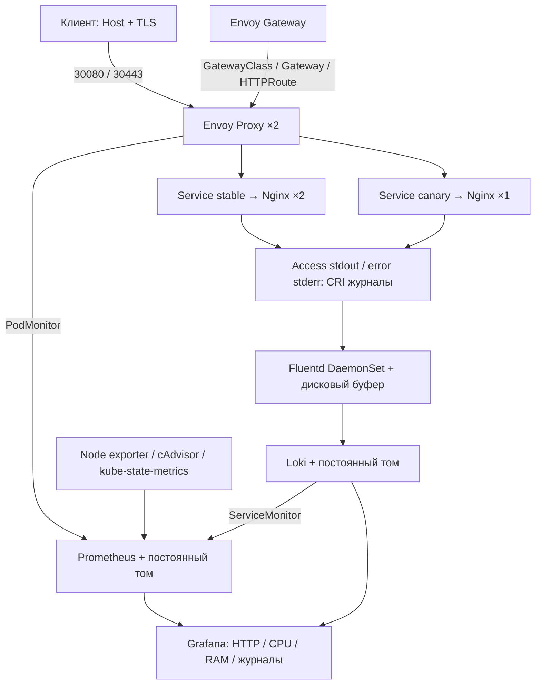

# MTC ENGINEER HACK — DevOps

Решение кейса DevOps: Kubernetes на Ubuntu 24.04, Nginx через Gateway API, метрики в Prometheus и логи через Fluentd в Loki. Для просмотра метрик и логов используется Grafana.

## Архитектура



Кластер из одного узла установлен через kubeadm, сеть — Calico. Envoy Gateway управляет ресурсами `GatewayClass`, `Gateway` и `HTTPRoute`; маршруты ведут к Service приложения. Файлы находятся в `manifests/gateway.yaml`. Nginx выбран для простого Hello World, а kube-prometheus-stack устанавливает мониторинг одним Helm chart.

## Версии

| Компонент | Версия |
|---|---|
| Ubuntu | 24.04; проверено 24.04.5 arm64 |
| Kubernetes | v1.35.9, deb 1.35.9-1.1 |
| containerd / runc | 2.2.1 / 1.3.4 |
| Calico / Helm | v3.33.0 / v3.22.0 |
| Envoy Gateway | v1.9.2 |
| kube-prometheus-stack | chart 91.9.0 |
| Prometheus / Grafana | 3.15.0 / 13.2.3 |
| Nginx | 1.28.0-alpine |
| Loki | 3.6.0 |
| Fluentd / плагин Loki | 1.19.3-debian-2.4 / 1.3.0 |
| Docker / Buildx | 29.1.3 / 0.30.1 |

Версии и контрольные суммы закреплены в `config/versions.env` и `images/fluentd/Dockerfile`. Docker нужен только для сборки Fluentd, контейнеры Kubernetes запускает containerd.

## Запуск

Нужна отдельная Ubuntu 24.04 amd64 или arm64 с sudo, Git и интернетом. Минимум — 2 CPU, 6 GiB RAM и 10 GB свободного диска; рекомендуется 4 CPU, 8 GiB RAM и диск 24 GB. Swap должен быть выключен. Установщик меняет настройки этой машины; при обнаружении чужого кластера или kubeconfig он остановится.

Все команды выполняются на этой Ubuntu. Если Git отсутствует, установите его: `sudo apt-get update && sudo apt-get install -y git`.

```bash
git clone --branch main https://github.com/SteffanBreak/mtc-engineer-hack-devops.git
cd mtc-engineer-hack-devops
sudo bash scripts/bootstrap.sh --dedicated-host
make deploy
make verify
```

Bootstrap устанавливает зависимости и Kubernetes, `make deploy` разворачивает приложение, Gateway, мониторинг и логирование. Повторный запуск на том же стенде и в том же каталоге проверяется командой `make idempotence`: данные, секреты и рабочие Pod должны сохраниться. Приватные файлы стенда находятся в `.local`, этот каталог не публикуется.

Вариант запуска на Mac описан в [docs/local-lab.md](docs/local-lab.md).

## Проверка приложения

```bash
NODE_IP=$(kubectl get nodes -o jsonpath='{.items[0].status.addresses[?(@.type=="InternalIP")].address}')
curl -H 'Host: demo.mtc.test' "http://$NODE_IP:30080/"
curl -H 'Host: demo.mtc.test' "http://$NODE_IP:30080/canary"
curl --cacert .local/tls/server.crt \
  --resolve "demo.mtc.test:30443:$NODE_IP" https://demo.mtc.test:30443/
curl -H 'Host: split.mtc.test' "http://$NODE_IP:30080/"
kubectl -n mtc-lab get gateway,httproute
```

Для `/` ожидается `Hello World! version=stable`, для `/canary` — `Hello World! version=canary`. На `split.mtc.test` запросы распределяются между ними с весами 90/10. Это учебные имена; покупать домен не нужно. HTTPS проверяется с сертификатом из `.local/tls`.

## Метрики и логи

Для Prometheus запустите:

```bash
kubectl -n mtc-observability port-forward service/mtc-monitoring-prometheus 9090:9090
```

Откройте `http://127.0.0.1:9090/targets`: настроенные targets должны быть `UP`. На странице `/graph` выполните запросы:

```promql
up
sum(envoy_http_downstream_rq_total{envoy_http_conn_manager_prefix=~"https?-.*"})
sum by (pod) (rate(container_cpu_usage_seconds_total{namespace="mtc-lab",container="nginx"}[2m]))
sum by (pod) (container_memory_working_set_bytes{namespace="mtc-lab",container="nginx"})
```

После нескольких HTTP-запросов счётчик Envoy должен вырасти; дождитесь следующего сбора метрик. Prometheus собирает данные Envoy, Loki, Kubernetes и узла. Grafana показывает HTTP-коды, частоту запросов, p95, CPU/RAM, готовность реплик и логи. Для графиков скорости нужны минимум два сбора метрик и трафик.

В другом терминале запустите Grafana:

```bash
kubectl -n mtc-observability port-forward service/monitoring-grafana 3000:80
```

Адрес — `http://127.0.0.1:3000`, логин — `admin`. Пароль можно посмотреть в свободном терминале командой `cat .local/grafana-password`. Дашборд **MTC DevOps — проверяемый стенд** и источники Prometheus/Loki создаются автоматически.

Fluentd читает access-логи Nginx из stdout и error-логи из stderr, затем отправляет их в Loki. В Grafana откройте Explore, выберите Loki и выполните:

```logql
{app="mtc-demo",stream="stdout"}
{app="mtc-demo",stream="stderr"}
```

`make verify` делает запрос с уникальным ID и запрос к отсутствующему файлу, затем проверяет появление соответствующих access/error-записей в Loki. Результат сохраняется в `.local/verification.json`.

## Дополнительно и проверки

- Настроены HTTPS, маршруты по имени и пути, распределение stable/canary 90/10.
- У stable и Envoy по две реплики, есть probes, лимиты ресурсов и PDB. Nginx работает без root, с read-only файловой системой. NetworkPolicy разрешает вход к приложению только от Envoy и запрещает исходящие соединения.
- Логи и метрики хранятся на постоянных томах. При недоступности Loki Fluentd повторяет отправку из дискового буфера.
- [GitHub Actions](https://github.com/SteffanBreak/mtc-engineer-hack-devops/actions/workflows/validate.yml) запускает `make lint`: проверяет Bash, Python, Helm, YAML и отсутствие секретов в исходниках.

| Команда | Что проверяет |
|---|---|
| `make verify` | Приложение, Gateway, TLS, метрики, логи и Grafana |
| `make demo` | Дополнительно 200 запросов для распределения трафика и NetworkPolicy |
| `make resilience` | Обновление Nginx под запросами и сохранение данных после перезапуска Loki/Prometheus |
| `make idempotence` | Повторную установку без изменения данных, секретов и рабочих Pod |
| `make status` | Состояние узлов, приложения, Gateway и хранилища |

Результаты запусков сохранены в [evidence](evidence/README.md). Проверены две чистые Ubuntu arm64 и повторная установка; при обновлении Nginx получено 55 ответов без ошибок. Проверки установленного стенда выполняются отдельно от GitHub Actions.

## Ограничения

- Один узел и локальные тома: при потере машины стенд недоступен. Retain не заменяет резервные копии, размер PV не ограничивает фактический расход диска. Prometheus хранит данные 24 часа / до 1 GB, Loki — 24 часа с отложенным удалением.
- TLS-сертификат самоподписанный, действует 30 дней. Для постоянной эксплуатации нужны доверенный сертификат и автоматическое продление.
- Защищённые метрики scheduler, controller-manager, etcd и kube-proxy не собираются. Fluentd работает с UID 0 для чтения логов узла, без Linux capabilities; каталог логов доступен только для чтения.
- Образ Fluentd собирается для текущего узла. Для нескольких узлов нужен registry. AMD64 предусмотрен скриптами и образами, но отдельно проверялся только ARM64.
- Alertmanager установлен, внешние уведомления не настроены. Для дальнейшего развития нужны несколько узлов, резервные копии, нагрузочные тесты и алерты.

Основные каталоги: `scripts` — установка и проверки, `charts/demo` — приложение, `manifests` и `values` — настройки, `dashboards` — Grafana. При ошибке начните с `make status` и `kubectl -n mtc-observability get events --sort-by=.lastTimestamp`.
